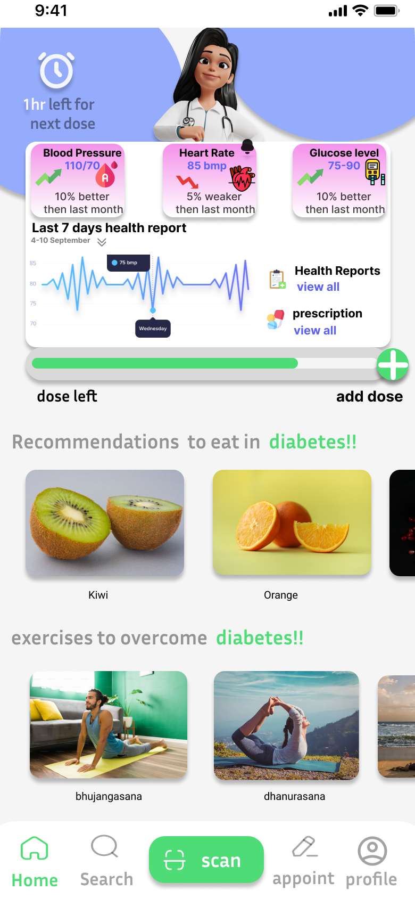
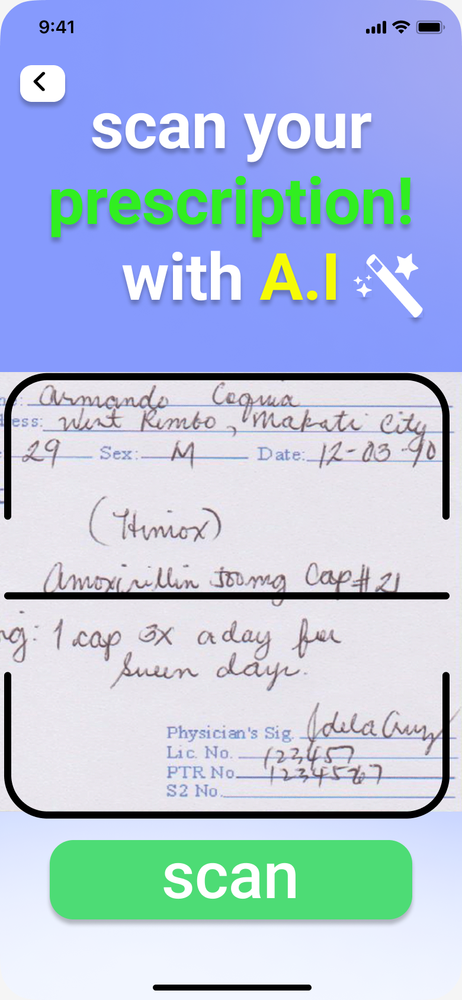

# NersyPillManager UI/UX Design

Welcome to the UI/UX design repository for NersyPillManager, your personalized pill management and health recommendation app.

## About

NersyPillManager is envisioned as a comprehensive application that assists users in managing their medication intake effectively while providing personalized health recommendations tailored to individual needs. This repository contains the UI/UX design assets and concepts for the app.

## Design Goals

- **User-Friendly Interface**: Design an intuitive and easy-to-use interface that simplifies the pill management process for users of all skill levels.

- **Clear Visual Hierarchy**: Establish a clear visual hierarchy to guide users' attention and actions within the app, ensuring a seamless user experience.

- **Personalization**: Incorporate features that allow users to customize their experience and receive personalized health recommendations based on their unique profiles.

## Design Concepts

### 1. Home Screen

- The home screen provides users with an overview of their medication schedule and any upcoming doses.
- Clear call-to-action buttons allow users to easily add new pills or view their health recommendations.

## AI Prescription Reader

NersyPillManager incorporates an AI prescription reader feature, allowing users to scan and digitize their paper prescriptions for easy access and management within the app. The AI-powered technology accurately extracts relevant information from prescriptions, such as medication names, dosages, and refill instructions, saving users time and effort in manual data entry.

### 3. Health Recommendations

- Health recommendations are presented in a personalized feed based on users' medical history, lifestyle factors, and wellness goals.
- Users can explore recommended activities, diet plans, or lifestyle changes to support their overall health and recovery.

## Feedback and Collaboration

We welcome feedback and collaboration from the community to further refine and improve the UI/UX design of NersyPillManager. If you have any suggestions or would like to contribute, please feel free to [open an issue](https://github.com/pandeyji711/NersyPillManager-UI-UX/issues) or reach out to us directly.

## Acknowledgements

We would like to express our gratitude to the design community for their support and inspiration in creating the UI/UX design for NersyPillManager.

Thank you for exploring our design concepts for NersyPillManager. We hope you find them engaging and user-friendly!

